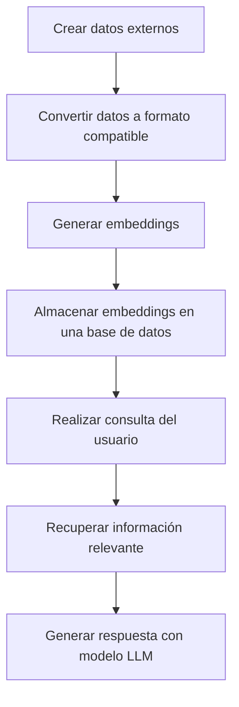

# RAG (Retrieval-Augmented Generation)

Cuando hablamos de RAG (Generación mejorada por recuperación), nos referimos a un proceso en el cual los modelos pueden dar mejores respuestas a las peticiones porque pueden usar información externa que no necesariamente fue parte de su entrenamiento previo.

## ¿Cómo funciona?

### 1. Crear datos externos

Antes de nada, necesitamos los datos externos que vamos a usar para mejorar la respuesta del modelo. Estos datos pueden ser de cualquier tipo, pero lo más común es que sean documentos de texto, PDFs, etc. Siguiendo con el ejemplo de mejorar un canal de YouTube, se puede utilizar como datos externos documentación de YouTube diseñada para este fin.

Dado que está en formato HTML, se puede usar una herramienta llamada [MarkItDown](https://github.com/microsoft/markitdown), que convierte diferentes tipos de documentos e incluso URLs a un formato más fácil de procesar por los LLMs. Este módulo ya está incluido en el archivo `requirements.txt` de esta sección, por lo que solo necesitas instalarlo:

```bash
cd rag
pip install -r requirements.txt
```

Una vez instalado, puedes ejecutar el siguiente archivo que contiene un conjunto de URLs de la documentación de YouTube:

```bash
python 1.convert_urls.py
```

Esto generará un conjunto de documentos en formato Markdown en un directorio llamado `youtube_guides`. Sin embargo, esto no es suficiente. Ahora es necesario convertir estos documentos a embeddings, un formato vectorial que los modelos pueden procesar. Para ello, ejecuta:

```bash
python 2.convert_markdown.py
```

Si intentas este proceso sin dividir los documentos en partes más pequeñas, podrías encontrarte con un error de longitud máxima. Aquí tienes un ejemplo de cómo se vería el error:

```bash
python 2.convert_markdown_sin_chunks.py
```

### 2. Almacenar los embeddings en la base de datos

Una vez generados los embeddings, se almacenan en una base de datos vectorial. En este caso, se utiliza Qdrant, aunque puedes usar cualquier otra base de datos vectorial.

Puedes acceder a la interfaz de Qdrant en [http://localhost:6333/dashboard](http://localhost:6333/dashboard) para visualizar lo que se va almacenando. Inicialmente, no habrá datos.

Para almacenar los embeddings, utiliza el siguiente script:

```bash
python 3.store_embeddings.py
```

Si todo funciona correctamente, deberías ver los datos reflejados en la interfaz de Qdrant.

#### 2.1 Configuración de las colecciones en Qdrant

En Qdrant, las colecciones son como tablas en una base de datos relacional. Cada colección tiene un nombre y contiene un conjunto de puntos (o embeddings) relacionados. Por ejemplo, se puede crear una colección llamada `youtube_guides` para almacenar los embeddings generados a partir de la documentación de YouTube.

Cuando guardas vectores en Qdrant, estás almacenando representaciones numéricas de algo (textos, imágenes, usuarios, etc.). Para buscar lo más parecido a un vector, Qdrant calcula la distancia entre ellos. Según el tipo de datos y cómo generaste los vectores, debes elegir una métrica de distancia adecuada.

**Principales tipos de distancia en Qdrant:**

1. **Cosine Similarity (Cosine en Qdrant)**  
    Úsala cuando:
    - Los vectores representan contenido semántico, como textos o embeddings de modelos como BERT, OpenAI, etc.
    - Te importa más la dirección del vector que su magnitud.

    Ejemplo:  
    Si tienes un modelo que transforma frases en vectores, "cómo cocinar arroz" estará más cerca de "cómo preparar arroz blanco" que de "cómo cultivar arroz".

2. **Euclidean Distance (L2) (Euclid en Qdrant)**  
    Úsala cuando:
    - Te importa la distancia geométrica real entre puntos.
    - Los vectores tienen un significado físico o numérico directo (por ejemplo, coordenadas).

    Ejemplo:  
    Si estás guardando vectores con información como tamaño, peso o color RGB, esta métrica es ideal.

3. **Dot Product (Dot en Qdrant)**  
    Úsala cuando:
    - Los vectores no están normalizados y su magnitud también tiene sentido.
    - Es común en sistemas de recomendación.

    Ejemplo:  
    En sistemas como Netflix o Spotify, donde los vectores no están normalizados, esta métrica es útil.

| Caso de uso                              | Tipo de métrica       | Nombre en Qdrant |
|------------------------------------------|-----------------------|------------------|
| Textos, frases, embeddings de lenguaje   | Cosine similarity     | Cosine           |
| Coordenadas, datos numéricos físicos     | Euclidean (L2)        | Euclid           |
| Recomendación con embeddings no normalizados | Dot product       | Dot              |

### 3. Realizar consulta del usuario

Una vez almacenados los embeddings, se pueden realizar consultas para recuperar información relevante y generar respuestas con un modelo LLM. Para ello, se utiliza el siguiente script:

```bash
python 4.query_embeddings_and_generate_response.py
```


## ¿Cuál es el proceso completo?


