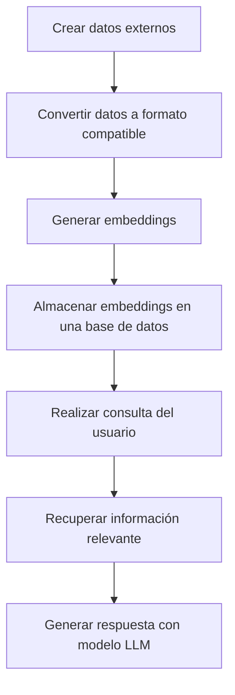

# RAG (Retrieval-Augmented Generation)

Cuando hablamos de RAG (Generación mejorada por recuperación suena un poco raro 😅) se trata de un proceso en el cual los modelos pueden dar mejor respuesta a la petición que se les ha hecho porque pueden usar información externa que no tiene por que ser información con la que fueron entrenados previamente.


# ¿Cómo funciona?

## 1. Crear datos externos

Antes de nada, necesitamos los datos externos que vamos a usar para mejorar la respuesta del modelo. Estos datos pueden ser de cualquier tipo, pero lo más común es que sean documentos de texto, PDFs, etc. Siguiendo con mi ejemplo de mejorar mi canal de YouTube, lo que voy a hacer es utilizar como datos externos documentación de YouTube que está pensada para este fin: 

Como está en un formato HTML, lo que voy a hacer es utilizar una herramienta llamada [MarkItDown](https://github.com/microsoft/markitdown) que está pensada para convertir diferentes tipos de documentos e incluso URLs a un formato que sea más fácil para los LLMs. Este módulo ya forma parte del archivo `requirements.txt` de esta sección por lo que solo tienes que instalarlo con `pip install -r requirements.txt` y ya lo tienes disponible.

```bash
cd rag
pip install -r requirements.txt
```

Una vez que lo tenemos instalado puedes ejecutar este archivo que tiene un conjunto de URLs de la documentación de YouTube que puede resultar interesante para mejorar las respuestas.

```bash
python 1.convert_urls.py
```

¡Perfecto! Ya tenemos un conjunto de documentos en formato Markdown que podemos usar para mejorar las respuestas del modelo. Al ejecutar este script se generará un directorio llamado `youtube_guides` que contendrá los documentos en formato Markdown. Pero esto no es suficiente. Ahora lo que tenemos que hacer es convertir estos documentos a lo que se conoce como embeddings. Esto convertirá estos documentos a un formato vectorial para lo cual tenemos modelos que nos pueden ayudar a hacer esta conversión. Para convertirlos puedes usar este otro script:

```bash
python 2.convert_markdown.py
```


# Embeddings


# ¿ Cuál es el proceso completo?




