# RAG (Retrieval-Augmented Generation)

Cuando hablamos de RAG (Generación mejorada por recuperación suena un poco raro 😅) se trata de un proceso en el cual los modelos pueden dar mejor respuesta a la petición que se les ha hecho porque pueden usar información externa que no tiene por que ser información con la que fueron entrenados previamente.


# 쮺칩mo funciona?

## 1. Crear datos externos

Antes de nada, necesitamos los datos externos que vamos a usar para mejorar la respuesta del modelo. Estos datos pueden ser de cualquier tipo, pero lo más común es que sean documentos de texto, PDFs, etc. Siguiendo con mi ejemplo de mejorar mi canal de YouTube, lo que voy a hacer es utilizar como datos externos documentación de YouTube que está pensada para este fin: 

Como está en un formato HTML, lo que voy a hacer es utilizar una herramienta llamada [MarkItDown](https://github.com/microsoft/markitdown) que está pensada para convertir diferentes tipos de documentos e incluso URLs a un formato que sea más fácil para los LLMs. Este módulo ya forma parte del archivo `requirements.txt` de esta sección por lo que solo tienes que instalarlo con `pip install -r requirements.txt` y ya lo tienes disponible.

```bash
cd rag
pip install -r requirements.txt
```

Una vez que lo tenemos instalado puedes ejecutar este archivo que tiene un conjunto de URLs de la documentación de YouTube que puede resultar interesante para mejorar las respuestas.

```bash
python 1.convert_urls.py
```

¡Perfecto! Ya tenemos un conjunto de documentos en formato Markdown que podemos usar para mejorar las respuestas del modelo. Al ejecutar este script se generará un directorio llamado `youtube_guides` que contendrá los documentos en formato Markdown. Pero esto no es suficiente. Ahora lo que tenemos que hacer es convertir estos documentos a lo que se conoce como embeddings. Esto convertirá estos documentos a un formato vectorial para lo cual tenemos modelos que nos pueden ayudar a hacer esta conversión. Esta es la pinta que tienen estos documentos cuando los convertimos a embeddings:

```bash
python 2.convert_markdown.py
```

Si intentas hacer este proceso sin partir los docuemtos en partes más pequeñas, es posible que te encuentres con un error de longitud máxima. Aquí tienes un ejemplo de cómo se vería el error:

```bash
python 2.convert_markdown_sin_chunks.py
```

Ok, ya sabemos hacer embeddings. 쯏 ahora qué hacemos con esto? lo que vamos a hacer es almacenarlos en una base de datos de tipo vectorial que he añadido como parte de esta Dev Container. En este caso, he utilizado Qdrant, pero puedes usar cualquier otra base de datos de tipo vectorial.

Puedes ver su interfaz accediendo a [http://localhost:6333/dashboard](http://localhost:6333/dashboard) y podrás ver lo que vamos almacenando. Por ahora no hay absolutamente nada. 

## 2. Almacenar los embeddings en la base de datos

Ahora que ya sabemos cómo convertir los documentos a embeddings, lo que vamos a hacer es almacenarlos en la base de datos. Para ello, vamos a usar el siguiente script:

```bash
python 3.store_embeddings.py
```

Este script se encargará de almacenar los embeddings en la base de datos. Si todo ha ido bien, deberías ver algo como esto en la interfaz de Qdrant:


### 2.1 Configuración de las colecciones en Qdrant

Quizás esta es la parte que más me costó entender. En Qdrant, las colecciones son como tablas en una base de datos relacional. Cada colección tiene un nombre y contiene un conjunto de puntos (o embeddings) que están relacionados entre sí. En este caso, hemos creado una colección llamada `youtube_guides` que contendrá todos los embeddings que hemos generado a partir de los documentos de la documentación de YouTube. Las colecciones son la forma en la que Qdrant organiza los datos. Esta tiene una configuración asociada que tiene dos valores importantes:

- **Size**: Se 
- **Distance**: Este es el tipo de distancia que se va a usar para calcular la similitud entre los puntos. En este caso, hemos usado `Cosine` que es el más común para este tipo de tareas. 

Aquí tienes algunos ejemplos sencillos para entender cuándo usar cada una de las métricas de distancia en Qdrant:

Producto escalar (Dot):

Ejemplo: Tienes vectores de características de productos en una tienda online, y todos los vectores están normalizados.
Uso: Utiliza el producto escalar para encontrar productos similares basándote en características normalizadas como color, tamaño, y categoría.
Similitud del coseno (Cosine):

Ejemplo: Estás comparando documentos de texto, como artículos de blog o descripciones de videos de YouTube.
Uso: Utiliza la similitud del coseno para encontrar documentos que tienen contenido similar, independientemente de la longitud del texto.
Distancia euclidiana (Euclid):

Ejemplo: Tienes datos de ubicación geográfica de usuarios en una aplicación de mapas.
Uso: Utiliza la distancia euclidiana para calcular la distancia directa entre dos puntos geográficos y encontrar usuarios cercanos.
Distancia Manhattan (Manhattan):

Ejemplo: Estás analizando datos de ventas donde cada vector representa las ventas de diferentes productos en diferentes regiones.
Uso: Utiliza la distancia Manhattan para medir la diferencia absoluta en ventas entre regiones, lo cual puede ser útil para identificar patrones de ventas.


Cada registro se llama punto y tiene un ID único. Este ID es el que vamos a usar para recuperar la información más adelante. Por


## 3. Realizar consulta del usuario


# ¿ Cuál es el proceso completo?

```mermaid
graph TD
    A[Crear datos externos] --> B[Convertir datos a formato compatible]
    B --> C[Generar embeddings]
    C --> D[Almacenar embeddings en una base de datos]
    D --> E[Realizar consulta del usuario]
    E --> F[Recuperar información relevante]
    F --> G[Generar respuesta con modelo LLM]
```




